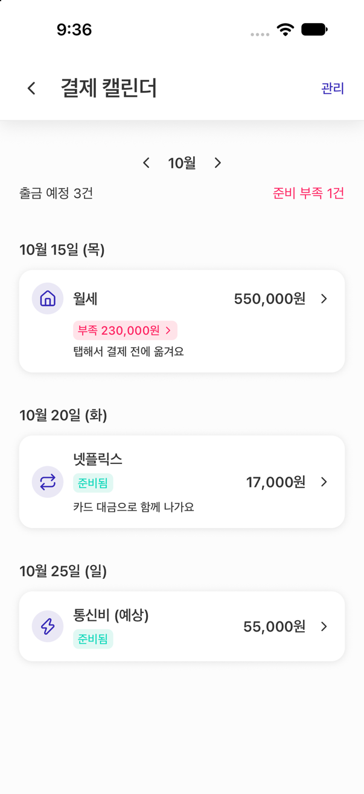
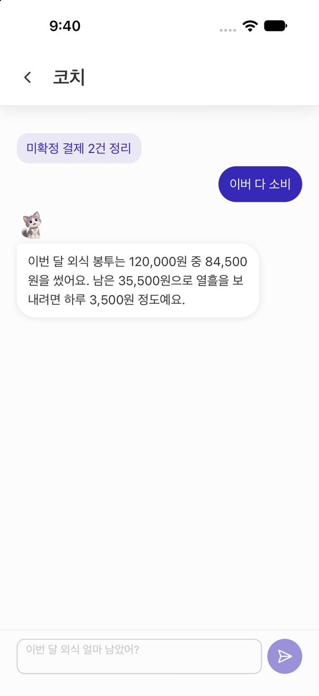

# KeyFin

소비 내역을 자동으로 모아 분류하고, 봉투(소비 카테고리) 7종 예산으로 안내하며,<br> 정기 지출을 위한 결제 계좌 준비 이체를 승인 기반으로 실행하는 생활 금융 관리 앱입니다. <br>방·캐릭터·코인으로 예산 상황을 보여줍니다.

> 저는 **프론트엔드를 담당**했고, 이 문서는 프론트엔드를 중심으로 씁니다.<br>
> 백엔드·AI 코칭·결제 시뮬레이터는 팀원 담당 영역이며 
> <br>저장소 구성 절에서 위치만 안내합니다.

<!-- 스크린샷은 frontend/docs/images/ 에 넣고 아래 경로를 맞춘다. frontend 루트의 images/ 는 gitignore 대상이라 GitHub 에 올라가지 않는다. -->
| 홈(방) | 예산 | 결제 캘린더 | AI 코칭 |
| --- | --- | --- | --- |
|  |  |  |  |

## 핵심 기능

- **온보딩**: 금융망 연결 → 계좌·카드 선택 → 소비 분석 → 예산 제안/승인 → 캐릭터 입주. 첫 예산 확정을 기기에 기록.
- **거래**: 백엔드가 수집한 거래를 봉투에 자동 분류하고, 미확정 거래를 세분류 시트로 정리합니다.
- **예산**: 봉투 7종 잔액과 비상금, 봉투별 거래 상세. 예산 초과 시 방 바닥 가구에 딱지가 붙고 복구하면 떨어집니다.
- **결제**: 정기 지출 캘린더, 고정지출 등록/관리, 결제 준비 이체 승인, 카드 청구 상세.
- **방·캐릭터·코인**: Skia 라이브러리 캔버스 위의 방 씬, 가구 배치, 보관, 방향 전환 편집기, 상점, 코인 이력.
- **AI 코칭**: 코칭 대화, 예산 예측 차트, 홈 코치 말풍선.
- **알림**: FCM 푸시와 딥링크, 알림함, 이체, 코치, 알림 설정.

시연 흐름은 온보딩 → 예산 제안 → 결제 → 봉투 차감·아바타 반응 → 코칭 → 결제 준비 이체 승인 → 코인 순서입니다.

## 내 역할 — 프론트엔드

| 항목 | 값 |
| --- | --- |
| 기간 | 2026-08-20 ~ 2026-09-28 |
| 팀 구성 | 6인 (프론트 1 · 백엔드 3 · AI 2) |
| 통신 도메인 | 11 |
| 화면 | 30여 개 |
| 테스트 파일 | 52 |

- 화면·기능 구현 전부와 라우팅, 상태 관리, 통신 계층 설계
- 백엔드 계약 사본 관리와 배포 Swagger 대조
- Android 개발 빌드(EAS) APK 배포와 EAS Update
- Pencil 디자인 원천 → 코드 토큰 자동 생성 파이프라인
- AI 코딩 에이전트용 규칙·스킬·자동 검사 훅(하네스) 설계와 운용

## 실행하기

```bash
cd frontend
pnpm install
pnpm start          # pnpm a: Android, pnpm w: 웹
```

환경 변수 없이 실행하면 11개 통신 도메인이 전부 목(`frontend/api/mocks/`)으로 동작합니다. 백엔드나 금융망 키 없이 모든 화면을 볼 수 있고, 개발 빌드의 로그인 화면에는 테스트 계정이 미리 채워집니다. 목 응답에는 지연이 들어 있어 로딩·오류 상태까지 실제처럼 확인됩니다.

실서버로 붙이려면 `frontend/.env.example`을 `.env`로 복사하고 백엔드 주소를 적습니다. `EXPO_PUBLIC_LIVE_DOMAINS`에 도메인을 나열하면 그 도메인만 실서버로 가고 나머지는 목을 유지합니다.

## 프론트엔드 설계

### 스택

| 영역 | 기술 |
| --- | --- |
| Runtime | Expo SDK 57 · React Native 0.86 · React 19 · TypeScript strict |
| Routing / Styling | Expo Router · NativeWind v4 |
| 서버·클라이언트 상태 | TanStack Query · Zustand · axios |
| 방 씬 | @shopify/react-native-skia · react-native-gesture-handler · Reanimated 4 |
| 보안 | expo-secure-store · expo-local-authentication |
| UI | React Native Reusables(shadcn 규약) · lucide-react-native · Pretendard |
| 테스트 | jest-expo · React Native Testing Library |
| 빌드 | expo-dev-client / EAS · pnpm |

### 구조와 통신 계층

- `app/`은 라우트 조립만 하고, 기능은 `features/<domain>/`에 `api/`, `components/`, `model.ts`로 나눕니다.<br> 
도메인은 auth · settings · link · account · transaction · budget · payment · room · shop · notification · coaching 입니다.
- 공용 axios 인스턴스 하나가 Bearer 헤더, 응답 봉투 해제, 401 시 refresh 1회 재시도를 맡습니다. 토큰 재발급 클라이언트는 인터셉터를 붙이지 않아 재귀를 만들지 않습니다.
- 각 도메인 API 함수는 첫 줄에서 목 여부를 확인합니다. 백엔드가 도메인별로 순차 배포되는 동안 "인증·연결은 실서버, 거래·결제는 목"처럼 섞어 개발할 수 있게 한 스위치입니다.
- 서버 데이터는 TanStack Query만 다루고, Query Key 팩토리와 AbortSignal 전달을 규칙으로 둡니다. 클라이언트 전역 상태는 Zustand, 토큰은 SecureStore 입니다.

### 방 씬

- Skia 캔버스에 바닥·가구·캐릭터 스프라이트 시트를 그리고, 제스처 핸들러로 가구를 옮기고 보관하고 방향을 바꿉니다.
- 편집은 사본에만 반영하고 완료 시 설치 가구 전체를 PUT 한 번으로 저장합니다. 저장 중에는 편집과 뒤로 가기를 잠그고, 실패하면 사본을 유지해 다시 저장할 수 있습니다.
- 화면에 표현하지 못하는 서버 가구는 원본 좌표·방향·layer를 그대로 되돌려 보내 보존합니다.

### 핀테크 규칙

금액 정밀도, 이체 멱등성, PIN·생체 인증, 계좌·카드 마스킹, 로그에 남기면 안 되는 값 같은 규칙을 `frontend/.agents/rules/80-fintech-security.md`에 두고 에이전트와 사람이 같은 기준으로 작업했습니다.

## 디자인 파이프라인

```
design.pen (Pencil, 확정 원천 — 변수 51개 + 아트보드)
  └─ pnpm tokens:sync ─▶ design/tokens.json ─▶ tailwind.config.js · global.css · lib/theme.ts
```

- 코드에는 시맨틱 토큰(`bg-background`, `text-muted-foreground`, `text-amount-lg` …)만 노출됩니다. hex, 프리미티브 팔레트, arbitrary value는 `pnpm tokens:check`가 잡습니다.
- 라이트·다크는 CSS 변수로 전환되어 색상에 `dark:` 변형이 필요 없습니다.
- 화면을 만들기 전 `design/design-map.json`의 Pencil 노드 id로 시안을 대조하고, 시안이 없는 화면은 `design/DESIGN.md` 기준으로 만들어 "미대조"로 보고합니다.

## AI 코딩 하네스

에이전트가 디자인 원천과 핀테크 규칙을 일관되게 따르도록 만든 장치입니다. 팀 저장소에서는 프론트 1인 전용이라 추적하지 않았고, 이 저장소에서 공개합니다.

- `frontend/.agents/rules/` 규칙 10개. 기본, React 상태, API·데이터, TypeScript 구조, 스타일·접근성, 오류·보안, 의존성·테스트, 디자인 토큰, 핀테크 보안, 백엔드 계약. 각 규칙은 `paths` frontmatter로 적용 경로를 제한합니다.
- `frontend/.agents/skills/` 프로젝트 전용 스킬 2개. Pencil 대조·토큰 동기화 절차와 핀테크 UI 패턴 체크리스트.
- `frontend/.claude/settings.json`의 PostToolUse 훅이 편집 직후 토큰 위반 검사, 산출물 재생성, `.agents` → `.claude` 미러 동기화를 자동 실행합니다.
- 진입점은 `frontend/AGENTS.md`이고 `CLAUDE.md`는 이를 가리키기만 합니다.

## 백엔드 계약 관리

- 계약의 원천은 팀 Notion 명세와 배포 서버 Swagger이고, `frontend/docs/api-contract.md`가 클라이언트 쪽 사본입니다. 요청·응답 타입을 TypeScript로 적어 두고 배포 서버와 전수 대조했습니다.
- 명세와 배포 서버가 다르면 문서에 날짜와 함께 기록하고 앱은 배포 서버 기준으로 구현했습니다. 목 기간의 차이는 버그가 아니라 계약 차이로 다뤘습니다.
- 통신 코드를 쓰는 절차는 `frontend/docs/api-guide.md`에 있습니다. DTO ↔ 모델 변환, 오류 봉투, 계약 불일치 오류 타입을 여기서 정합니다.

## 품질과 배포

- push 전 검증은 로컬 명령으로 합니다. `pnpm typecheck` · `pnpm lint` · `pnpm test` · `pnpm tokens:check` · `pnpm harness:check`. CI 워크플로는 두지 않기로 했습니다.
- 테스트는 jest-expo와 React Native Testing Library로 씁니다. 애니메이션 타이밍에 의존하지 않는 단언, SecureStore 목 같은 RN 특유의 처리를 포함합니다.
- Android 개발 빌드는 EAS `preview` 채널로 APK를 만들고 EAS Update로 JS를 갱신합니다. 절차는 `frontend/PREVIEW_UPDATES.md`에 있습니다.

## 저장소 구성

| 경로 | 내용 | 담당 |
| --- | --- | --- |
| `frontend/` | React Native 앱 (이 문서의 대상) | 나 |
| `backend/key-fin/` | Spring Boot API. JPA · MySQL · Redis · Flyway · Spring Security(JWT) · springdoc · Firebase Admin(FCM) | 백엔드 팀원 |
| `ai/coaching/` | FDT 코칭 API (Python). 거래 이벤트 저장, 예산 초과 감지, 코칭 카드·대화·예측 | AI 팀원 |
| `keyfin-pay/` | 결제·정기결제·출금 시연용 웹 (Express · MySQL, 금융망 API 중계) | 팀원 |
| `infra/` | Jenkins 배포 스크립트 | 팀원 |

## 문서

- [frontend/README.md](frontend/README.md) — 프론트 기술 가이드 (명령, 디렉토리, 규칙 요약)
- [frontend/docs/frontend-spec.md](frontend/docs/frontend-spec.md) — 기능 ID · 화면 목록 · 이동 흐름 · 비즈니스 규칙
- [frontend/docs/api-contract.md](frontend/docs/api-contract.md) — API 계약 사본과 불일치 기록
- [frontend/docs/api-guide.md](frontend/docs/api-guide.md) — 통신 코드 작성 절차
- [frontend/AGENTS.md](frontend/AGENTS.md) — 에이전트 진입점
- [frontend/PREVIEW_UPDATES.md](frontend/PREVIEW_UPDATES.md) — APK · EAS Update 배포
- [ai/coaching/README.md](ai/coaching/README.md) — AI 코칭 API (팀원 작성)
<!-- 회고: frontend/docs/retrospective.md 작성 후 여기에 링크 -->
