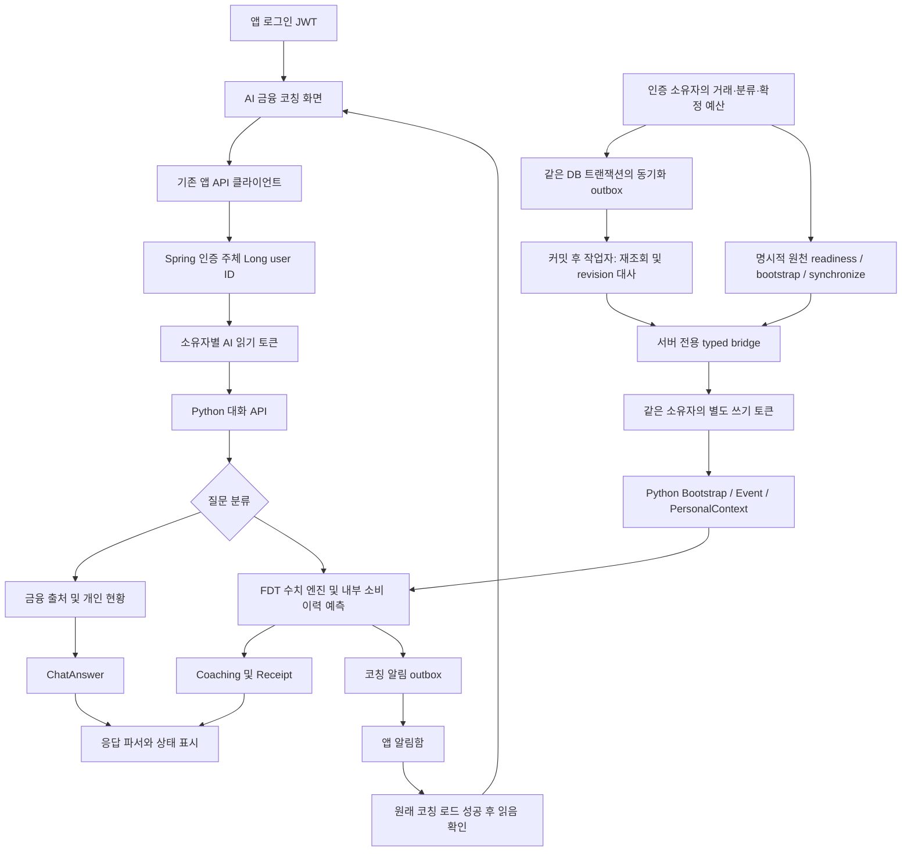

# 앱과 AI 코칭 서비스 연결

일반 금융 질문, 개인 자료 조회, 예측 코칭을 같은 대화 화면에서 받는 앱 연결 코드다. **구현·로컬 HTTP 검증·실제 GPU 응답 계약 검증과 실제 서비스 배포는 서로 다른 상태**다. 이 문서는 2026-09-14 기준으로 확인된 범위와 남은 연결 작업을 구분한다.

## 코드를 읽는 순서

| 역할 | 경로 | 책임 |
| --- | --- | --- |
| 앱 진입 | `frontend/app/coach.tsx`, `coach-notifications.tsx` | 앱 로그인·약관 상태 검사. 금융 연결 전에도 일반 질문 진입 허용 |
| 화면·대화 상태 | `frontend/features/coaching/components/`, `useCoachingChat.ts` | 빈 대화, 연속 질문, 대기·실패·재시도, 원래 코칭 열기 |
| 앱 HTTP 경계 | `frontend/features/coaching/api.ts`, `model.ts` | 기존 JWT 클라이언트 사용, Zod 응답 검사, 출처·자료 상태·예측 날짜 표시 |
| 보호 프록시 | `backend/key-fin/.../coaching/CoachingController.java`, `CoachingClient.java` | 인증 주체로 소유자 토큰 선택, 고정 API 경로, 제한 시간·크기·오류 처리 |
| 서버 전용 자료 입력 | `CoachingDataBridge.java`, `PersonalContextInput.java`, `EngineInput.java` | 소유자별 쓰기 토큰과 정확한 입력 외곽 계약 |
| 원천 DB 조회·대사 | `CoachingSourceRepository.java`, `CoachingSourceAdapter.java` | 인증 소유자의 거래·분류·확정 예산을 읽고 지원하는 원천 사실을 FDT에 반영 |
| 자동 동기화 | `CoachingTransactionListener.java`, `CoachingSourceOutbox.java`, `CoachingSourceWorker.java` | 원장과 같은 트랜잭션에 요청 저장, 커밋 후 별도 작업자의 재시도 |
| 실행 설정 예 | `backend/key-fin/src/main/resources/application-coaching-example.properties` | 기본 비활성, 비밀값 없는 서버 설정 예 |
| 테스트 | `frontend/features/coaching/__tests__/`, `backend/key-fin/src/test/java/com/finset/key_fin/coaching/` | 파서·화면 동작·대화·HTTP·권한 선택·자료 계약 회귀 |

코드 경로의 `.../coaching/`는 `src/main/java/com/finset/key_fin/coaching/`다. 테스트 코드와 실행 코드를 분리했다. 원본 응답, 번들, 로그는 각각 별도 실험 저장소 또는 무시되는 `.expo/qa/`·Gradle `build/`에 보관하며 소스에 넣지 않는다.



## 화면에서 유지하는 계약

- 빈 대화는 `POST /sessions`에 `{}`를 전달한다. 일반 금융 질문에 과거 코칭 ID가 필요하지 않다.
- 후속 질문은 같은 서버 세션을 사용한다. 응답을 기다리는 동안 중복 전송을 막고, 불확실한 실패 후 재시도는 같은 생성 키·질문 키를 사용한다.
- 서버의 `needs_source`, `needs_data`, `out_of_scope`, `unavailable`, `needs_clarification`을 성공 문구로 바꾸지 않는다. 개인 현황 `personal_context`에 출처 목록이 없는 경우도 받는다.
- `Receipt`가 있다는 이유만으로 미래 예측 성공으로 표시하지 않는다. 결제·정기 코칭은 ‘코칭’으로 표시하고 수치 결과의 `partial`·`insufficient_data`를 구분한다.
- 예측 기간은 **`forecast_start`부터 `forecast_end`까지**다. 예를 들어 기준일 9월 3일의 월말 요청에서 요청 구간은 9월 1~30일이어도 미래 구간은 9월 4~30일이다. 화면에서 다시 30일을 더하거나 월초를 미래 시작일로 사용하지 않는다.
- 알림함은 Python의 `type=COACHING` 계약을 읽는다. 원래 코칭 조회가 성공한 뒤에만 읽음 확인을 요청하고, 후속 대화는 그 코칭 ID로 시작한다.
- 저장된 세션은 `message.response`의 종류·ID로 원래 답변을 조회해 출처·Receipt·기간·자료 상태를 복원한다. 일부 조회가 실패하면 해당 메시지의 저장된 본문을 유지하고 재시도를 제공한다. 참조가 없는 레거시 메시지는 ‘저장된 답변’으로 구분한다. 요청과 다른 ID·종류의 응답은 표시하지 않는다.
- 앱 API 설정이 없으면 ‘서버가 아직 연결되지 않았다’는 오류를 표시한다. 테스트용 금융 답변을 정상 응답으로 생성하지 않는다.

## 앱 API와 서버 API

모든 앱 경로는 `/api/v1/coaching` 아래이며 기존 `BaseResponse`에 원본 AI JSON을 담는다.

| 앱 메서드·상대 경로 | Python 경로 |
| --- | --- |
| POST `/sessions` | `/v1/sessions` |
| GET `/sessions/{id}` | `/v1/sessions/{id}` |
| POST `/sessions/{id}/messages` | `/v1/sessions/{id}/messages` |
| POST `/questions` | `/v1/finance/questions` |
| POST `/personal/questions` | `/v1/personal/questions` |
| GET `/answers/{id}` | `/v1/answers/{id}` |
| GET `/records/{id}` | `/v1/coaching/{id}` |
| GET `/notifications` | `/v1/notifications` |
| POST `/notifications/{id}/ack` | `/v1/notifications/{id}/ack` |
| GET `/source/readiness?asOf=YYYY-MM-DD` | 원천 DB의 지원 여부만 검사 |
| POST `/source/bootstrap` | DB 변환 후 `/v1/bootstrap` |
| POST `/source/synchronize` | `/v1/twin`을 읽고 필요한 `/v1/events`만 전달 |

앱에는 AI/GPU 주소나 토큰을 제공하지 않는다. `coaching.user-tokens[앱 사용자 ID]`는 Python의 같은 소유자에 발급된 user-role 토큰이어야 한다. `backend-tokens`는 동일 소유자의 별도 backend-role 토큰이다. **알림함·읽음 확인은 별도 `notification-tokens`를 사용한다.** Python은 user-role 토큰의 알림 접근을 403으로 거절하며, 알림 토큰이 없을 때 사용자·쓰기 토큰으로 우회하지 않는다. 모든 역할·소유자의 토큰이 서로 다른지 시작 시 검사하며, 필요한 매핑이 없으면 요청 전에 503으로 거절한다. 정확한 소유자 ID와 토큰 역할의 실제 발급·배포 매핑은 배포 담당자가 확인해야 한다. 브라우저가 입력한 사용자 ID로 매핑을 바꾸는 API는 없다.

쓰기 토큰은 `CoachingDataBridge`만 사용한다. 이 메서드를 거래 동기화 서비스에 연결할 때도 인증·도메인에서 확정한 소유자를 전달해야 한다. 사용자가 업로드한 JSON으로 전체 금융 상태를 교체하는 공개 컨트롤러는 제공하지 않는다.

상위 서버는 미리 설정한 HTTP(S) origin만 사용하며 리다이렉트를 따르지 않는다. 운영망의 전송 구간은 TLS 또는 승인된 내부망 설정을 적용해야 한다. 연결 제한 5초, 전체 응답 기본 제한 60초(최대 2분), 응답 크기 상한 8MiB를 둔다. 헤더가 먼저 도착해도 본문 수신까지 전체 제한이 적용된다. 원본 에러 본문·인증 헤더는 사용자 응답이나 로그에 넣지 않는다.

## 자료 동기화에서 구현한 부분과 남은 부분

`PersonalContextInput`은 보험·소득·고정비·목표를 원 단위 정수, 기준일, 원천 시스템·레코드, 자료 범위, revision으로 받는다. 자료 범위 `unknown`은 빈 항목이어야 하며 같은 항목 ID가 중복되면 거절한다. `complete`는 원천 시스템이 해당 범위를 제공했다는 표시이며 독립적인 금융 검증 완료를 뜻하지 않는다. 계좌·자산·부채·예정 결제는 기존 FDT 스냅샷을 이용한다.

`EngineInput.Bootstrap`과 `EngineInput.Event`는 Python의 외곽 계약을 제공한다. 내부 거래·스냅샷 문서는 손실 없이 전달하고 정식 FDT 정규화·소유권 검사를 통과해야 한다. 임의의 카드 결제와 대금 정산을 합치거나 지출로 간주하는 변환은 하지 않는다.

R15에서는 현재 V1 원천 스키마와 최신 `develop`의 변경을 대조하여 **JDBC 원천 어댑터와 JPA 변경에 따른 durable outbox를 구현했다.** 운영 DB에는 적용하지 않았으며, 합성 레코드를 넣은 독립 H2 DB와 실제 Spring/Python HTTP로 확인했다. 앱의 source POST 입력은 `{ "asOf": "YYYY-MM-DD" }`뿐이다. 거래 ID·금액·소유자를 브라우저에서 받아 대신 신뢰하는 방식이 아니다.

### 원천 자료의 지원 범위

| 자료·행동 | 변환과 제한 |
| --- | --- |
| 거래 이력 | 인증 소유자의 기준일 포함 과거 365일, 최대 10,000건. 기준일 이후와 타인 거래 제외. 계좌·카드 참조도 같은 소유자인지 검사 |
| 확정 봉투 | `CONFIRMED` 예산의 7개 `confirmed_amount`에서 해당 실제 예산 주기 시작일부터 기준일까지의 확정 지출을 차감. 원화 정수 사용 |
| 분류 | 원본 22개 세분류 유지. `마트 → 장보기`만 같은 의미의 FDT 입력 별칭으로 번역하고 `source_category`, `source_subcategory`, `source_mapping_version=keyfin-db-to-fdt/1` 보존 |
| 대기·내 계좌 이체 | `PENDING`, `SELF_TRANSFER` 등 원본 상태 유지. 예산 지출에 중복 합산하지 않음 |
| 부분 분담·환입 | `DUTCH`, `RESTORE`, `adjusted_amount`는 제품 SQL과 FDT의 예산 의미가 달라 전체 쓰기를 차단. 문제가 있는 행을 빼고 성공으로 표시하지 않음 |
| 입금·이체의 소비 분류 | 확정 입금·이체가 일반 소비 봉투에 차감되는 모순은 원천에서 정정하기 전 차단 |
| 현금·카드 정산 | `snapshot=null`, `cashForecastReady=false`. V1에는 관측 잔액이 없고, 최신 잔액 필드도 장중 관측이므로 임의의 마감 잔액으로 변환하지 않음 |
| 신규·취소 | LIVE 신규 거래를 먼저 반영한 다음 취소를 반영. 취소 시 같은 DB 조회의 실제 봉투 잔액을 전달. 이미 관측한 변경은 재전송하지 않음 |
| 정정·삭제 | 기존 거래의 금액·계좌 등 불변값 변경, 확정 지출의 재분류, 취소 복원, 물리 삭제는 추측하지 않고 명시적 대사 필요 상태로 차단 |

`readiness`의 원인에는 코드·건수만 담는다. 원장 거래 ID, 계좌번호, 원본 오류 또는 비밀값을 브라우저 진단에 싣지 않는다. `canSyncHistory=true`는 현재 지원 계약에 맞는다는 뜻이며, 실제 고객 예측 정확도의 증거가 아니다. 현재 DB 상태를 기준일로 잘라 읽는 기능이며, 과거 시점에 알려져 있던 상태를 재현하는 독립 OOS 데이터셋도 아니다.

### 날짜·예산 주기와 자동 재시도

기존 `BudgetPeriod`와 저장된 `budget_anchor_day`를 존중한다. V1에 이 컬럼이 없을 때만 기존 달력월 계약인 1일을 쓴다. 25일 시작 사용자는 8월 25일~9월 24일을 한 예산 주기로 유지한다. 이 주기를 달력월 성능평가의 ‘9월 예산’으로 전달하지 않는다(`period_not_calendar_month`에 해당). 원천에는 불변 편성의 승인 시각이 없으므로 월간 평가 API에 임의로 승인 날짜를 만들어 넣지 않는다.

엔진 기준일은 실제 거래 또는 권위 있는 스냅샷으로만 전진한다. 다음날 신규 관측 없이 같은 자료만 있으면 `stale_engine_cutoff`로 차단하며 ‘최신 동기화 완료’로 표시하지 않는다. 새 예산 주기나 확정 편성 변경도 기존 봉투 잔액에 덧붙이지 않고 대사를 요구한다. Bootstrap은 최초 생성용이며 기존 Twin 교체를 허용하지 않는다.

자동 경로는 JPA의 `Transaction` 저장·변경 콜백이 **같은 DB 트랜잭션**에 사용자별 generation을 올리는 요청만 저장한다. 원장이 롤백되면 요청도 롤백된다. 원격 HTTP는 커밋 이후 별도 작업자만 실행한다. 요청은 사용자별로 합쳐지고, 5분 lease와 revision을 사용하며, adapter 호출 1회에 최대 이벤트 1개를 적용한다. R16부터 tick당 기본 최대 20회를 순차 처리하고, 10초가 지나면 새 호출을 시작하지 않는다. 진행 중인 호출의 강제 종료 제한과는 다르다. 처리 중 새 변경이 생겨도 그 generation은 남는다. 실패는 30초부터 최대 1시간 간격으로 재시도하며 원격 오류가 이미 커밋한 원장 거래를 취소하지 않는다. [R16 보고서](source-sync-improvement-r16.md)에 설정·재현·지연 비교와 한계를 정리했다.

활성화에는 V8 마이그레이션, 같은 소유자의 `owner-ids`·backend-role 토큰, `coaching.enabled=true`, `coaching.source-sync-enabled=true`가 필요하다. 예제의 기본값은 비활성이다. **현재 작업 브랜치를 운영 DB에 직접 적용하지 않는다.** 먼저 최신 develop의 V1~V7과 통합한 뒤 마이그레이션 순서를 확인한다. 다른 팀이 V8을 추가했다면 미적용 상태에서 버전 충돌을 해결해야 한다. **직접 SQL·JPQL bulk update는 JPA 콜백을 거치지 않는다.** 그러한 배치 경로는 같은 트랜잭션에서 `enqueue`를 호출하도록 연결하거나 명시적 `/source/synchronize` 대사를 수행해야 한다. 이번 검증은 운영 MySQL 마이그레이션·실제 JWT 인증·운영 사용자 토큰 발급·운영 DB 동기화·FCM 발송 성공을 의미하지 않는다.

## 검증 기록과 한계

- 앱 코칭 모델·API·대화 상태 18건 통과. 빈 세션, 같은 세션의 연속 질문, 타임아웃 재시도 키, 알림 원본 조회 전 읽음 방지, 기간·상태, 재접속 근거 복원과 일부 복구 실패를 검사했다.
- 실제 컴포넌트 테스트 3건 통과. 빈 화면 질문 보내기, 자료 부족 표시, 알림 열기 경로를 검사했다. 이는 모바일·브라우저의 실제 픽셀 렌더 검증과 다르다.
- Spring 보호 프록시·자료 bridge·응답 크기 검사 20건 통과. 로컬 실제 HTTP 수신기로 별도 소유자·알림 역할 토큰, 원문 수치·날짜, 전체 본문 제한 시간, 실패 상태를 검사했다. 운영 Spring 인증 서버와 GPU를 직접 연결한 배포 스모크는 아니다.
- 별도 임시 DB를 사용하는 실제 Python FastAPI ASGI 라우트에서도 user 세션 생성 200, user 알림 목록·읽음 확인 403/403, notification 알림 목록·읽음 확인 200/200을 재현했다. 이 권한 검사는 주입한 테스트 모델을 사용하며 GPU 추론 성능 시험으로 집계하지 않는다.
- 실제 GPU 추론을 거친 합성 사용자 API 응답 10종과 재시작 세션 1종을 원문 그대로 읽는 선택 실행 테스트가 11/11 통과했다. 금융 개념·개인 계좌·범위 제한·취소 전후 지출·예측·위험 응답을 파싱하고, 실제 재시작 후 14개 메시지의 assistant 답변 7개 참조를 모두 복원했다. 원본의 파일 크기와 SHA-256을 검사한다. `COACHING_API_FIXTURE_DIR`가 없으면 이 11건을 생략하며, 일반 CI의 고정 21건(위 18건 + 컴포넌트 3건)과 분리한다. R15 최종 선택 실행은 32/32이며 별도 실시간 HTTP 2건은 이 실행에서 생략한다.
- R15 Spring 전체 코칭 검증은 48/48이다. 기존 20건에 원천 JDBC 10건, 대사 보호 조건 10건, 실제 Hibernate/outbox 6건, 실제 Spring HTTP 2건을 추가했다. 필수 외부 환경변수가 없으면 마지막 Python 왕복 1건은 생략되므로 일반 CI는 47건 실행·1건 생략이다. outbox 검증은 같은 트랜잭션의 원장·요청 롤백, 사용자별 합치기, 새 generation 보존, lease 중복·만료, 원격 실패 후 원장 보존을 검사한다.
- 독립 H2 원장과 임시 SQLite Python 서비스를 연결한 실제 TCP 왕복에서 지출 10,000원 → 신규 60,000원 반영 후 70,000원 → 취소 후 10,000원과 revision 2를 확인했다. 중복 동기화는 `unchanged`이며 금액이 변하지 않는다. 같은 서버를 실제 앱 axios 클라이언트로 호출한 2/2는 일반 금융 질문과 빈 세션·소비 질문·응답 참조 복원을 검사한다. 이 시험은 history 경로를 고정한 주입 모델과 합성 인증 필터를 사용하므로 LLM 경로 선택 정확도, GPU 성능 또는 실제 JWT 로그인 검증으로 합산하지 않는다.
- V1의 세분류 22개를 읽고 실제 고정 FDT `normalize`로 변환한 별도 호환성 검사도 22/22다. 원본 봉투·세분류가 모두 보존됐다. 의미가 다른 사례의 회계 지원 또는 고객 예측 정확도까지 증명하는 검사는 아니다.
- TypeScript 검사와 코칭 범위 ESLint, `pnpm@11.13.0 install --frozen-lockfile`이 통과했다. 잠금 파일은 기존 해석을 유지하고 필요한 14줄만 추가했다. Zod 응답 검사, 실제 번들링에 필요한 Babel JSX 플러그인, 파일 기반 계약 테스트의 Node 타입 선언을 직접 의존성으로 명시했다.
- 최종 Expo web export 성공. 첫 실행에서 Metro 캐시 역직렬화 실패 후 전체 재탐색으로 복구했고 색상 환경 경고가 있었다. 최종 `--clear` 빌드에서는 의도한 빈 캐시 재생성 안내만 남았으며, 로그의 `error.*.png`는 Expo Router 정적 이미지 이름임을 원문으로 확인했다. 배포 빌드 성공은 실제 화면 동작 확인을 대신하지 않는다.
- 홈·금융연결을 포함한 확대 실행은 50개 테스트가 통과했지만 테스트 후 열린 비동기 핸들 때문에 프로세스가 종료되지 않아 중단했다. 확대 실행을 깨끗한 종료 성공으로 집계하지 않는다. 별도 코칭 28건 실행은 종료 코드 0까지 확인했다.
- 정상 localhost Expo 화면 접근 중 CDP 시간초과와 연결 오류가 발생했고, 브라우저가 만든 `data:` 오류 페이지는 URL 정책에 의해 차단됐다. 차단된 페이지에 우회 접근하지 않았다. **실제 데스크톱·모바일 화면 렌더와 실제 인증 후 화면 왕복은 미검증이다.**
- OS 푸시(FCM 등) 실제 발송, 실제 고객의 미래 금융 정확도, 원본 차트의 앱 내 임베딩은 이 연결 코드의 검증 범위에 포함되지 않는다.

재현 명령은 각 디렉터리에서 실행한다. 테스트 자료·서버 토큰은 소스에 추가하지 않는다.

최종 로컬 증거 캡슐은 계정의 `artifacts/tool-output`에 보관한다. R15 합성 원천·HTTP 원문·로컬 실행기는 무시되는 `ai/coaching/artifacts/r15/app/`에 둔다. 원본 응답·절대 사용자 경로·인증값을 MR에 첨부하지 않는다. 아래 R14 빌드 기록은 유지하며, R15는 별도 행으로 구분한다.

| 검증 | 캡슐 ID | 종료 상태 |
| --- | --- | --- |
| R15 원천·outbox·Spring/Python TCP 및 앱 HTTP | `20260914-160153010-aae9f088` | BE 48/48 + 앱 HTTP 2/2, exit 0 |
| R15 고정 21 + 실제 GPU 원문/재접속 11 | `20260914-160152952-5139aa4d` | 32/32, 별도 HTTP 2건 생략, exit 0 |
| R15 TypeScript | `20260914-155731745-b5cf1afd` | 통과, exit 0 |
| R15 코칭 ESLint | `20260914-155731745-a2278f81` | 통과, exit 0 |
| 코칭 고정 21 + 실제 GPU 응답 7 | `20260914-143438734-0da08a36` | 28/28, exit 0 |
| Spring 모듈 및 HTTP·역할·자료 계약 | `20260914-143438768-e9a23924` | 20/20, exit 0 |
| TypeScript | `20260914-143812509-34edc6cb` | 통과 |
| 코칭·홈·금융연결 변경 파일 ESLint | `20260914-144000060-061b0ed0` | 통과 |
| 고정 잠금 파일 설치 | `20260914-143722227-11849339` | pnpm 11.13.0, 통과 |
| 초기 web export | `20260914-142245265-b930576f` | 성공, 캐시 복구·색상 경고 원문 확인 |
| 최종 web export | `20260914-143911428-7465800f` | 성공, 캐시 재생성 안내·정적 자산 이름 원문 확인 |
| 홈·금융연결 확대 실행 | `20260914-142515387-a9af6313` | 50건 통과 후 미종료, 중단 |

R15 최종 Java 로그의 class-data-sharing 경고는 Mockito 계측으로 bootstrap classpath가 확장된 경우의 JVM 안내다. 컴파일의 deprecated API 안내도 남아 있으며 테스트 실패가 아니다. 초기 재수집에서는 PowerShell의 native stderr 직렬화 문제로 래퍼 오류가 발생했다. 위 최종 캡슐은 OS 단계에서 원문 stdout/stderr를 합쳐 이 수집 문제를 해소한 뒤 얻은 종료 코드 0과 테스트 XML을 기준으로 한다.

```powershell
# frontend
corepack pnpm@11.13.0 install --frozen-lockfile
pnpm exec tsc --noEmit
pnpm exec eslint features/coaching app/coach.tsx app/coach-notifications.tsx
pnpm exec jest --runInBand features/coaching
# 선택: 승인된 비민감 실험 응답 디렉터리를 지정한 뒤 실행
$env:COACHING_API_FIXTURE_DIR = '<응답 fixture 디렉터리>'
pnpm exec jest --runInBand features/coaching/__tests__/recorded-api.test.ts
pnpm exec expo export --platform web --output-dir .expo/qa/export

# backend/key-fin — JDK 21
.\gradlew.bat --no-daemon test --tests '*Coaching*Test' --tests '*LimitedResponseBodyTest' --console=plain
# 선택: 격리 Python 서버에 같은 소유자의 backend/user 토큰을 환경변수로만 공급
# COACHING_CONTRACT_API_URL, COACHING_CONTRACT_BACKEND_TOKEN, COACHING_CONTRACT_USER_TOKEN
# COACHING_VERIFY_FRONTEND=1이면 실행 중인 실제 Spring을 앱 클라이언트로 추가 검사
# COACHING_SOURCE_CAPTURE_DIR에는 무시되는 artifacts 아래 로컬 디렉터리만 지정
```
