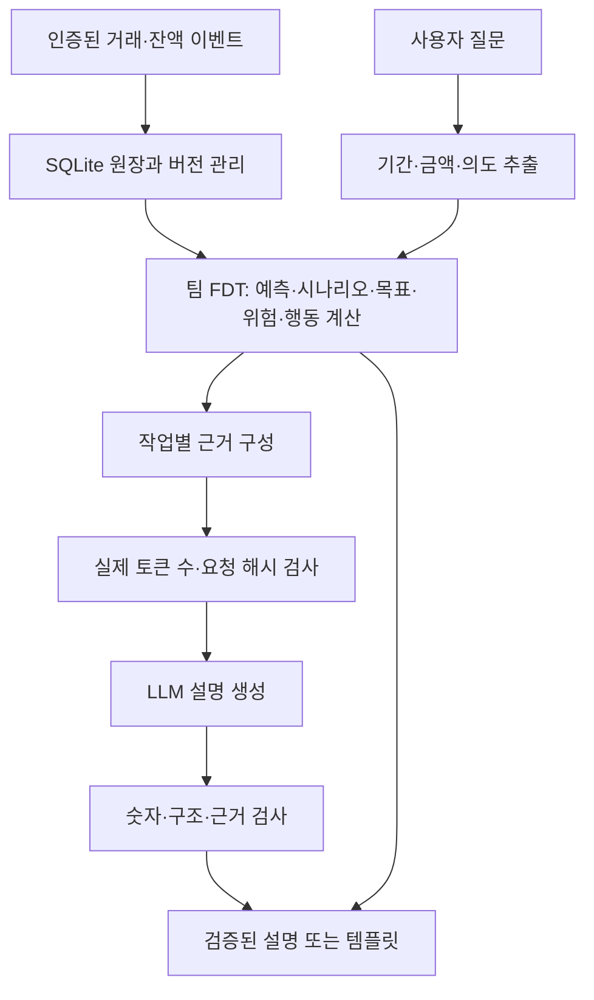

# 구조와 기간 계약

이 서비스의 금융 수치 계산자는 팀 FDT입니다. LLM이 미래 잔액을 직접 만들어 반환하지 않습니다.

## 책임 구분

FDT 원본은 commit `307de59c9d1fde01774388257da27730754e5118`에서 가져온 21개 파일입니다. 시작 시 [`ENGINE_MANIFEST.json`](../ENGINE_MANIFEST.json)의 SHA-256으로 확인합니다. 엔진 갱신은 파일과 manifest를 함께 검증하는 별도 변경으로 진행합니다.

LLM은 결제 상황이 코칭 대상인지 판단하는 보조 분류, 질문의 분석 종류·조건 추출, FDT 결과 설명을 맡습니다. 모델 출력은 곧바로 거래·잔액·알림 확정값이 되지 않습니다. 원장의 사용자 격리, 중복 이벤트, 버전 충돌과 수치 검사는 API가 처리합니다. 서버가 보관한 원본 FDT 결과는 설명에 필요한 일부 근거를 선택하더라도 유지합니다.

추론 실패·잘못된 숫자·규격 위반은 템플릿으로 대체됩니다. 따라서 **API 성공률, LLM 설명 채택률, 미래 소비 예측 오차는 서로 다른 지표**입니다.

## 입력 길이 계약

과거에는 근거 JSON의 글자 수만 검사해 서비스 요청은 통과했지만 추론 서버에서 `HTTP 413: input_token_limit`이 발생했습니다. 현재는 중복 근거를 줄이고 작업에 필요한 필드만 보내며, 같은 요청 본문을 `/v1/tokenize`로 먼저 측정합니다.

추론 서버는 채팅 템플릿과 응답 규격까지 포함한 실제 토큰 수, 요청 해시, 프롬프트 해시를 반환합니다. 서비스는 서버 한도와 일치하는 요청만 생성에 사용합니다. 현재 워커의 최대 입력은 8,192토큰, 최대 출력은 1,536토큰입니다. 글자 수와 HTTP 본문 크기 제한도 별도로 유지합니다. 다른 모델/토크나이저를 연결할 때도 이 계약을 충족해야 합니다.

## 기준일과 예측 기간

`as_of`는 관측을 마친 날짜입니다. 기본 미래 예측은 **다음 날부터 종료일까지**입니다. 입력은 날짜 전용 `YYYY-MM-DD`이며 시간 문자열은 받지 않습니다.

| 요청 `period` | 2026-09-10 기준 의미 | 미래 계산 날짜 |
| --- | --- | --- |
| `{"kind":"rolling_days","days":30}` | 앞으로 30일 | 9월 11일~10월 10일 |
| `{"kind":"rolling_days","days":30,"include_reference_date":true}` | 기준일을 포함한 달력 30일 | 관측일을 제외한 9월 11일~10월 9일, 미래 29일 |
| `{"kind":"month_end"}` | 이번 달 말까지 | 9월 11일~9월 30일 |
| `{"kind":"through_date","end_date":"2026-10-10"}` | 명시한 목표일까지 | 9월 11일~10월 10일 |

응답의 해석된 기간과 종료일을 화면에 함께 표시해야 합니다. ‘이번 달 예산’에 자동으로 30일 예측을 붙이지 않습니다. 분석 요청의 구조화된 기간과 질문에서 추출한 기간이 충돌하면 명확한 계약 검사를 거칩니다.

미래 기간은 1~90일을 지원합니다. 계산할 미래 날짜가 없거나 범위를 넘으면 422입니다. 그레고리력 월말과 윤년의 2월 29일은 처리하지만 음력 윤달과 공휴일 출금일 조정은 구현 범위에 포함하지 않습니다. 90일 요청 지원과 90일 예측 정확도 입증은 별개이며, 현재 데이터로 후자는 확인하지 못했습니다.
