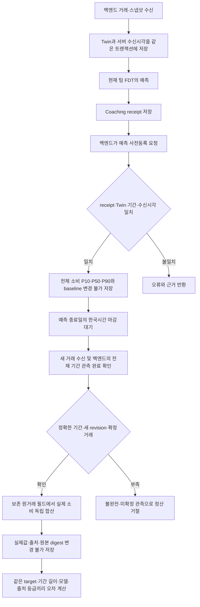

# 실제 미래 결과와 예측을 대조하는 API

이 기능은 **이미 저장된 FDT 예측을 먼저 고정하고, 예측 기간이 끝난 뒤 들어온 거래로 오차를 계산**한다. 합성 질문의 경로 선택 성공률을 금융 예측 정확도로 바꾸는 기능이 아니다. 현재 완료한 것은 실제 예측 receipt를 사용하는 사전등록·후정산 기능과 재현 시험이며, 실제 고객의 미래 관측 성능은 아직 확보하지 않았다.

## 무엇을 예측하고 무엇과 비교하는가

첫 지원 대상은 `total_variable_consumption / purchase_time_consumption/v1`, 원 단위 전체 변동소비다. 현금 잔액·봉투 예산 잔액·고정비를 합친 총출금이 아니다. 저장된 `Coaching.receipt.numeric_result`의 `total_expense_p10_krw`, `total_expense_p50_krw`, `total_expense_p90_krw`를 그대로 사용한다. 각 지표의 단위 `KRW`와 근거 `simulation_consumption_only`도 검사한다. 봉투별 또는 날짜별 분위수를 합산하지 않는다.

| 원거래 | 이 검증의 변동소비 | 이유 |
| --- | --- | --- |
| 정상 확정 카드 구매·계좌 소비 | 포함 | 구매 시점의 소비 |
| 제3자에게 보낸 축의금·회비 등 | 포함 | 본인 계좌 이체와 구분 |
| `DUTCH`·`EMERGENCY`·`CARRYOVER`가 붙은 구매 | 포함 | 봉투 예산에서는 제외될 수 있으나 FDT 전체 소비에는 포함 |
| 카드 청구대금 납부 | 제외 | 앞서 발생한 구매를 다시 소비로 세지 않음 |
| 본인 계좌 이체·명시적 `TRANSFER`·저축투자 이체 | 제외 | 자산 이동 |
| ATM 출금·대출 상환·입금 | 제외 | 현재 예측 타깃의 변동소비가 아님 |
| 월세·관리비·공과금·통신·보험·세금·구독 등 확정 고정비 | 제외 | FDT의 별도 고정비 타깃 |
| 취소된 거래 | 제외 | 현재 관측 원장에서 취소됨 |
| 미확정 소비 | 정산 거절 | 금액을 확정하거나 0으로 간주할 수 없음 |

`forecast_validation_observations.py`는 보존된 `transactions[].raw`의 날짜·종류·방향·상태·분류·원금액을 직접 읽어 합산한다. `fdt.normalize`, FDT 예측·분류 함수, 모델 생성 답변을 정답 계산에 호출하지 않는다. 다만 **같은 제품 개발자가 명세를 옮긴 계산기**이므로 `independent_human_oracle=false`이다. 사람이 승인한 독립 정답을 확보했다는 뜻은 아니다.

현재 팀 엔진은 `vendor/fdt/model.py`의 관측 첫날부터 `as_of`까지 달력을 만들고 `vendor/fdt/simulation.py`에서 그 이력을 표집한다. 비교 기준도 같은 시작일·종료일·소비 정의를 사용한다. 과거 별도 연구의 365일 고정 실험과 구분해야 한다.

```text
baseline = 과거 관측 기간의 변동소비 합계 / 관측 달력 일수 × 예측 일수
```

Baseline은 `observed_calendar_day_mean/v1`이다. 관측 기간에 거래가 없는 날짜도 분모에 포함한다. 짧은 이력이나 과거 데이터의 누락 가능성은 baseline이 해결하지 않는다. 사전등록 결과에 실제 사용한 이력 시작일·종료일·일수·소비 합계를 남겨 검토할 수 있게 한다. 이력의 미확정 소비도 0으로 치환하지 않아 등록을 거절한다.

## 처리 구조



이 Mermaid는 처리 구조 설명용 소스다. 미래 기간이 끝나지 않았다면 시스템이 기다린 척 정답을 생성하지 않는다.

## 호출 순서

모든 쓰기 요청은 `Idempotency-Key` 헤더가 필요하다. 인증 주체는 기존 `Client`의 소유자와 역할을 사용하며 본문에서 임의 사용자를 선택할 수 없다.

### 1. 저장된 예측 등록 — 백엔드 권한

`POST /v1/forecast-validation/registrations`

```json
{
  "coaching_id": "앞서_저장된_예측_ID",
  "data_origin": "backend_attested_real",
  "source_reference": "내부_동의및데이터수집기록_식별자"
}
```

등록자는 예측 금액, 발행 시각, cutoff, 모델 버전, 분위수 또는 baseline을 요청에 넣을 수 없다. 서버가 원본 receipt와 현재 Twin에서 가져온다. 동일 coaching을 다른 키로 다시 등록하거나 출처만 바꿔 덮어쓰면 409다. 같은 키·같은 본문 재시도는 최초 결과를 돌려준다.

등록 시 확인하는 항목:

- receipt·현재 Twin의 사용자, twin ID, revision, input digest, 기준일 일치
- 원본 엔진 커밋, forecast 모드, horizon, 실제 다음 날부터 끝나는 날짜 계약
- 등록 이전에 서버가 받은 동일 revision의 수신 기록, 예측 발행 시각의 선후관계
- 등록 시각 이후의 날짜·시각을 가진 입력 거래나 미래 cutoff가 없음
- 전체 변동소비의 순서가 맞는 원 단위 P10 ≤ P50 ≤ P90
- 동일 미래 조건이 아닌 scenario 개입은 등록 대상에서 제외

등록에는 전체 receipt digest, 모델 정보와 digest, 정확한 기간, 데이터 출처 진술, 수신 시각, baseline을 보존한다. 기존 전체 receipt 자체는 원래 코칭 저장소에서 계속 읽을 수 있다.

### 2. 기간이 끝난 뒤 관측 완료 정산 — 백엔드 권한

`POST /v1/forecast-validation/registrations/{id}/settlement`

```json
{
  "coverage_start": "2026-09-10",
  "coverage_end": "2026-09-11",
  "complete": true,
  "source_reference": "해당기간_전체계좌및카드_관측완료기록"
}
```

실제 금액을 본문으로 받지 않는다. 서버는 현재 저장된 거래에서 합산한다. 위 기간은 예시이며 등록된 기간과 정확히 일치해야 한다.

서버의 한국시간이 종료일 다음 날 00:00보다 이르면 409다. 따라서 9월 10~11일 예측은 9월 12일 00:00부터 정산할 수 있다. 현재 Twin이 종료일 이후까지 갱신됐고 등록 당시보다 새 revision이어야 한다. 그 revision의 서버 수신 기록도 등록 이후여야 한다. 미확정 거래가 남거나 `complete=false`이면 점수를 만들지 않는다.

**관측된 실제 0원과 데이터가 안 들어온 것은 다르다.** 새 revision과 정확한 기간의 관측 완료 진술이 있어야 거래가 없는 기간을 0원으로 정산할 수 있다. `complete=true`는 인증된 백엔드의 진술이며, 이 API가 모든 금융기관·계좌의 수집 완결성을 외부에서 독립 확인하는 것은 아니다.

정산은 변경 불가다. 이후 취소·정정이 수신되어도 이미 평가한 실제값을 조용히 덮어쓰지 않는다. 대신 **새 metrics 요청마다 현재 원거래에서 같은 기간의 소비 합계와 건수를 다시 합산**한다. 고정된 실제값·건수와 달라지면 `409 validation_observation_revised`로 새 집계를 차단한다. 새로 미확정 소비가 생겨 실제값을 확정할 수 없는 경우도 집계하지 않는다. 기간 밖에서 이후의 일반 거래가 추가돼 전체 Twin digest만 달라진 경우는 거절하지 않는다.

기존 `GET .../settlement`는 최초 정산 당시의 기록을 그대로 반환한다. 이는 현재 정정된 실제값의 평가라는 뜻이 아니다. 취소·정정을 반영한 새 정답 버전과 승인 이력을 관리하는 별도 절차가 필요하며, 이 API는 원래 정산을 임의 수정하지 않는다.

### 3. 조회·지표 — 사용자 또는 백엔드 권한

- `GET /v1/forecast-validation/registrations/{id}`: 고정된 예측
- `GET /v1/forecast-validation/registrations/{id}/settlement`: 고정된 실제값과 출처
- `POST /v1/forecast-validation/metrics`에 `{"registration_ids":["id1","id2"]}`: 명시한 정산 결과 비교

동일 소유자의 완료된 ID를 1~100개 명시한다. 모르는 ID·미정산 ID는 404이며 중복 ID는 거절한다. 목록 저장소의 100개 조회 상한으로 결과를 몰래 자르지 않는다. 모든 요청 ID를 개별 읽어 확인한다. 전체 고객 모집단에 대한 자동 표본이 아니므로 `selection=explicit_settled_ids_not_population_sample`을 함께 반환한다.

예측 길이, 타깃 버전, 모델 digest, 엔진 커밋, 출처 등급·종류, baseline 방식이 다른 결과는 한 점수로 합치지 않는다. 각 출처 참조와 등록 ID도 결과에 포함된다. 같은 길이라도 창이 겹칠 수 있으므로 `overlapping_windows`, `non_overlapping_window_count`를 함께 반환한다. 겹치지 않는 창도 같은 사용자의 시계열이므로 통계적 독립 표본이라고 부르지 않는다.

## 숫자가 뜻하는 것

P50 예측을 `m`, 실제 소비를 `y`, P10을 `l`, P90을 `u`라고 한다. 여러 건의 아래 값을 평균한다.

| 지표 | 계산 | 해석 |
| --- | --- | --- |
| `mae_krw` | 평균 `abs(m-y)` | 평소 몇 원 틀렸는지, 낮을수록 좋음 |
| `wape` | `sum(abs(m-y)) / sum(y)` | 실제 소비 합계 대비 총 절대 오차의 비율. 0.2는 20%이며, 실제 합계가 0이면 null |
| `bias_krw` | 평균 `m-y` | 양수는 과대 예측, 음수는 과소 예측 |
| `coverage80` | `l <= y <= u`인 비율 | 중앙 80% 예측 구간 안에 실제값이 들어온 빈도 |
| `mean_interval_width_krw` | 평균 `u-l` | 불확실성 구간의 폭. coverage와 함께 해석해야 함 |
| `wis80_krw` | 아래 식 | 구간 폭과 벗어난 실제값의 벌점을 함께 계산. 낮을수록 좋음 |
| `baseline_mae_krw`, `baseline_wape`, `baseline_bias_krw` | 같은 실제값과 baseline 비교 | 복잡한 모델이 단순 과거 평균보다 나은지 비교 |

```text
IS80 = (u-l) + 10 × max(l-y, y-u, 0)
WIS80 = (0.5 × abs(m-y) + 0.1 × IS80) / 1.5
```

중앙 80% 구간 하나와 중앙값을 사용하는 WIS 정의다. 여러 분위수를 촘촘하게 평가한 전체 분포 점수라고 주장하지 않는다. 정의는 [Bracher 등, Evaluating epidemic forecasts in an interval format](https://journals.plos.org/ploscompbiol/article?id=10.1371/journal.pcbi.1008618)을 따른다. Baseline은 점 예측이므로 존재하지 않는 구간·WIS를 만들지 않는다.

예를 들어 구간 `[40, 80]`, 중앙값 `60`에서 실제값 `100`이면 절대 오차 40원, 편향 -40원, 구간 폭 40원, IS80 240원, WIS80 약 29.33원이다. 이를 실제값 50인 두 번째 사례와 함께 평가하면 MAE 25원, 편향 -15원, WAPE 1/3, coverage 0.5, 평균 WIS80 약 17.67원이다. 테스트는 이 숫자를 제품 함수로 다시 만들어 기대값으로 쓰지 않고 손계산 상수로 비교한다.

## 근거 등급과 아직 필요한 검증

| `data_origin` | 서버가 정하는 등급 | 근거의 한계 |
| --- | --- | --- |
| `synthetic` | `synthetic` | 가상 데이터 실험 |
| `historical_real` | `replay` | 역사 데이터 재생이며 사전 발행 증명이 아님 |
| `backend_attested_real` | 시각·수신 기록 조건 충족 시 `prospective_attested`, 아니면 거절 | 미래 시작 전 등록 및 백엔드 출처 진술. 독립기관·담당자의 진실성 승인은 아님 |

모든 등급에서 `real_accuracy_validated=false`다. 클라이언트가 `real`이라는 말을 보내는 것만으로 사람의 검증·동의·독립 감사를 확보할 수 없다. 수신 스탬프는 서버가 언제 데이터를 받았는지를 입증하며 공급자가 만든 시각·일 마감 상태·모든 계좌의 실제 존재와 누락 여부까지 인증하지 않는다. 과거 수신 스탬프가 없는 기존 receipt는 재생 평가로만 등록할 수 있다.

실제 고객 정확성을 주장하려면 동의와 공급자 출처 확인, 누락·지연·취소 처리 정책, 변경 전 고정한 평가 집단, 실제 만기가 지난 데이터, 여러 사용자·기간의 비교, 독립 평가자의 승인과 기준치가 필요하다. 현재 같은 사용자의 선택된 창에 대한 신뢰구간은 `not_estimated_single_owner_dependent_windows`다. 겹친 창을 독립 표본으로 부트스트랩해 과도하게 좁은 구간을 표시하지 않는다. 공개 은행 데이터 실험의 성능을 한국 고객의 잔액·월예산 정확성으로 옮겨 표현하지 않는다.

## 재현과 코드 검토 순서

1. `forecast_validation_contracts.py`: 불변 입력·출력, 원금액·분위수·등급
2. `forecast_validation_ingestion.py`: Twin과 같은 원자적 쓰기에 포함되는 최초 서버 수신 기록
3. `forecast_validation_receipts.py`: 실제 저장된 예측을 읽고 기간·동일 입력을 검사
4. `forecast_validation_observations.py`: 별도 원거래 합산과 같은 이력의 baseline
5. `forecast_validation.py`: 등록·후정산·동일 조건 집계·멱등성
6. `forecast_validation_metrics.py`: 읽을 수 있는 지표 산식
7. `forecast_validation_routes.py`: 백엔드 쓰기와 사용자 읽기 권한

```powershell
uv run pytest tests/test_forecast_validation_api.py tests/test_forecast_validation_guards.py tests/test_forecast_validation_metrics.py tests/test_forecast_validation_observations.py tests/test_forecast_validation_revisions.py
```

시험은 실제 팀 FDT·SQLite·HTTP API와 제어한 서버 시각을 사용한다. 숫자·raw 합산 단위시험과 API의 미래 등록→만기→거래 수신→정산→같은 프로세스에서 재생성한 앱 인스턴스 읽기·권한·삭제·멱등성을 구분한다. 이 시험의 원거래는 합성이며 LLM 응답은 주입된 시험 모델이다. 실제 GPU 자연어 품질이나 실제 고객 예측 정확도를 이 시험 건수로 표현하지 않는다. 실행 부산물은 기존 `artifacts/` 또는 pytest 임시 경로에 남기고 제품 소스·문서와 구분한다.
