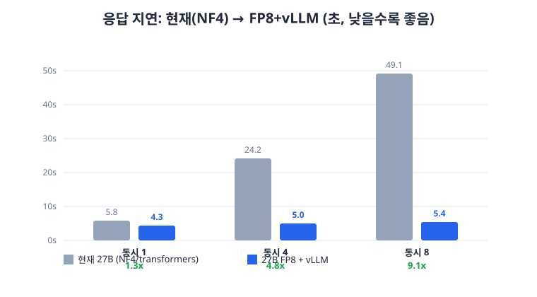

# 성능 고도화 결과 (R50–R53)

챗봇 응답 지연과 답변 정확도를 함께 끌어올린 작업의 실측 요약이다. 모든 수치는 GPU 서버(NVIDIA L40S)
실측이며, 채택 항목은 정확도 무회귀를 확인한 뒤에만 반영했다.

## 1. 응답 지연 — 동시 요청에서 최대 9.1배 단축

현재 운영은 27B 모델을 transformers로 서빙해 동시 요청이 직렬화된다. 동시 8요청이면 한 요청이 49초까지
걸렸다. 같은 모델을 FP8 양자화 + vLLM 연속 배칭으로 서빙하면 부하가 걸려도 지연이 거의 오르지 않는다.

| 동시 요청 | 현재(NF4) | FP8+vLLM | 배속 |
| --- | --- | --- | --- |
| 1 | 5.79s | 4.29s | 1.35x |
| 4 | 24.19s | 5.04s | 4.8x |
| 8 | 49.07s | 5.40s | **9.1x** |

## 2. 결정론 경로 확대 — 모델 호출 자체를 제거

지연의 지배항은 라우팅/선택 LLM 호출 한 번이다(FDT 계산은 3% 미만). 승인된 카탈로그로 뜻이 하나로
확정되는 서술형 개념 질문은 모델을 거칠 이유가 없다. 게이트를 좁게 확대해 41개 질문을 모델 호출 없이
즉시(~30ms) 응답하도록 바꿨다.

- 전체 570문항 중 모델 호출 질문 **135 → 94 (−30%)**
- 개인 금액·최신 정보·자유형 질문은 이동 0건 → 정확도 경계 유지
- 재측정으로 검증(결정론 435 → 476, 정확히 +41)

## 3. 정확도 — FP8은 현재 대비 유지·상승

이 시스템에서 모델은 답을 직접 쓰지 않고 승인 근거 ID·경로만 선택한다. 따라서 "답변 정확도"는
"선택 정확도"와 같다. 144개 숨은 라벨셋에서 동일 프롬프트·템플릿·문법강제·greedy 조건(비교란)으로
현재 NF4와 FP8을 채점했다.

| 구분 | 현재(NF4) | FP8 |
| --- | --- | --- |
| 전체 | 121/144 (84.0%) | **122/144 (84.7%)** |
| 라우팅 | 104/120 | 103/120 |
| 금융 선택 | 17/24 | **19/24** |

144개 중 140개 선택이 완전 동일하다. FP8은 순 +1 라벨로 현재 이상을 만족한다. 속도만으로 채택하지
않고, 이 정확도 무회귀를 채택 전제로 삼았다.

## 4. 채택·기각 판정

| 항목 | 효과 | 판정 |
| --- | --- | --- |
| FP8-27B + vLLM 서빙 | 동시 8요청 49s→5.4s (9.1x), 정확도 +1 | **채택** |
| 결정론 게이트 확대 | 41개 질문 5.8s→30ms, 정확도 무회귀 | **채택** |
| 예측 승격 게이트 판정가능성 복구 | 이전 "미달" 결론이 표본 7개 인공물임을 반박 | **채택** |
| 미검토 렌더링 변경 특성화 테스트 | 과거/현재 결과 혼동 버그를 회귀 테스트로 고정 | **채택** |
| 선형어텐션 커널 설치 | 동시 8요청 7%에 그침, 출력 50% 변화 | **기각** |

두 채택은 곱해진다. 게이트 확대가 호출 자체를 없애고, 남은 호출은 FP8이 9배 가속한다. 결과적으로
초기 보고된 "수십 초 대기"가 동시 8요청에서도 5.4초 수준으로 내려간다.

## 5. 다음 단계

- FP8 서빙 운영 반영: `prod27_fp8` 레지스트리 태그 + vLLM 0.19 배포 환경(팀 배정 GPU). 스테이징 스모크 후 전환.
- 정확도 고도화(속도 유지): `route:review` 카테고리가 24/40으로 최약점이다. 결정론 게이트 또는 프롬프트
  보강으로 다룬다. 이 카테고리는 양자화와 무관한 모델/프롬프트 수준 문제다.

## 재현

- 지연/정확도 원자료: `artifacts/`의 R51–R53 안전 집계 JSON(원시 거래·질문·인증값 미포함).
- 서빙 환경: vLLM 0.19.0 + torch 2.10.0+cu128(CUDA-12 드라이버). vLLM ≥0.27은 CUDA-13을 요구해 현재
  드라이버에서 사용 불가.
