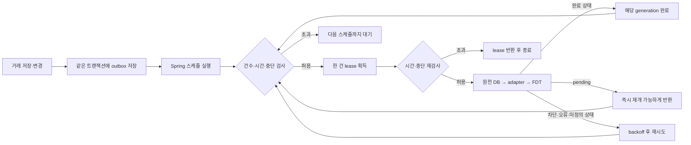

# R16: 거래 동기화 적체와 완료 판정 개선

## Jira에서 선택한 작업

2026-09-15에 김성진 담당 AI 코칭 업무를 확인했다. 78·79는 완료, 104(월간 예측 성능 진단·개선)와 110(사용 흐름 통합 테스트)은 진행 중이다. 이번 변경은 **110의 원천 거래 변경 → FDT 반영 지연과 실패 복구**를 개선한다. 이전 결과는 [R15 보고서](coaching-completion-r15.md)에 보존한다.

104의 고객 예측 정확도를 판정하려면 동의받은 고객의 당시 예측과 이후 실제 관측이 필요하다. 이번 큐 실험을 그 정확도로 집계하지 않는다. GPU 추론 모델·FDT 계산식·학습 가중치는 변경하지 않았다.

## 재현한 문제와 수정

| 문제 | 수정 전 관찰 | 수정 후 동작 |
| --- | --- | --- |
| 적체 | 준비된 60개 사용자 요청 중 tick 한 번에 1개만 처리 | 기본 최대 20회 순차 호출. 건수와 시간 예산 중 먼저 도달하면 종료 |
| 잘못된 완료 판정 | 알 수 없는 adapter 상태도 완료 generation에 기록 | `initialized`, `unchanged`, `synchronized`만 완료. null·미정의 상태는 재시도 코드 기록 |
| 부분 처리 재개 | 초 단위 TIMESTAMP가 소수 초를 반올림하면 재개 시각이 잠시 미래가 되어 다음 tick까지 지연 | 재개 시각을 명시적으로 초 단위 내림. 같은 tick에서 나머지 이벤트 처리 가능 |

원천 저장과 큐 저장은 기존처럼 같은 트랜잭션이다. 원격 호출은 커밋 이후에만 실행한다. 각 호출 직전에 한 건만 lease를 얻으며, 미리 여러 사용자 lease를 점유하지 않는다. 한 사용자의 실패·차단은 재시도 시각까지 보류하고 다른 사용자를 계속 처리한다. lease 만료·새 generation 보존·멱등성 계약을 유지한다.



## 설정의 의미

| 설정 | 기본값 | 의미 |
| --- | --- | --- |
| `coaching.source-sync-enabled` | `false` | 운영 원천 연결 전에는 자동 실행하지 않음 |
| `coaching.source-sync-delay-ms` | `30000` | 한 tick 종료 후 다음 tick까지의 간격 |
| `coaching.source-sync-max-jobs-per-tick` | `20` | 한 tick의 adapter 호출 상한. 허용 1~100 |
| `coaching.source-sync-time-budget` | `10s` | 다음 호출을 시작할 수 있는 시간 예산. 허용 1~60초 |

시간 예산은 monotonic clock으로 검사하므로 시스템 시각 보정에 영향을 받지 않는다. 느린 DB claim 후에도 다시 검사해 예산을 넘겼으면 lease를 반환한다. 이미 진행 중인 adapter 호출을 강제로 취소하지 않으며, 각 HTTP 요청은 기존 `coaching.timeout`을 사용한다. 따라서 **tick 전체가 반드시 10초 안에 끝난다는 제한이 아니다.** 기준일은 계속 한국 시간으로 계산한다. 이 배치는 GPU 추론 배치 크기와 다르다.

## 비교 실험과 해석

실제 H2의 outbox에 합성 사용자 60명의 준비된 요청을 넣었다. adapter는 모든 사용자에 동일한 성공 응답을 즉시 반환하도록 고정했다. 경과 시간은 고정해 큐 스케줄링만 비교하고, 각 사용자 호출 1회와 완료 generation을 조회했다. 기존 코드에서 한 tick 처리 1건을 먼저 재현한 뒤, 동일 응답을 사용해 상한 1과 20을 비교했다.

| 조건 | 완료 요청 | 필요한 tick | 사용자별 중복 호출 |
| --- | ---: | ---: | ---: |
| 상한 1 (기존 단일 처리 조건) | 60 | 60 | 0 |
| 상한 20 | 60 | 3 | 0 |

**필요한 스케줄 실행 횟수는 95% 감소**했다. 기본 간격 30초만 계산하면 첫 tick 이후 스케줄 대기 성분은 `59×30=1,770초`에서 `2×30=60초`가 된다. 이는 즉시 응답 조건의 계산이며, 실제 원격 처리 시간·네트워크·DB 부하·10초 시간 예산이 적용된 운영 완료 시간 측정이 아니다. 실제 AI 응답 속도가 20배 빨라졌다거나 예측 오차가 줄었다는 의미도 아니다.

## 검증 및 재현

신규 작업자 시험은 29건이다. batch 상한·부분 이벤트 완료·오류 격리·허용 상태·null/미정의 상태·시간 제한·느린 DB claim·스레드 중단·한국 날짜·설정 범위를 검사한다. 별도 시험은 **실제 Spring 스케줄러**를 켠 뒤 60개 요청을 넣어 완료 generation을 확인하며, adapter 동시 호출은 최대 1이다. 이 시험의 25ms 간격은 트리거 연결 확인용이며 운영 부하 시험이 아니다.

```powershell
# backend/key-fin, JDK 21
.\gradlew.bat --no-daemon test --tests '*CoachingSourceWorker*Test' --tests '*CoachingSourceOutboxTest' --console=plain
.\gradlew.bat --no-daemon test --tests '*Coaching*Test' --tests '*LimitedResponseBodyTest' --console=plain
```

최종 Spring 코칭 회귀는 **77/77 통과, 생략 0, 실패 0**이다. 기존 48건에 신규 29건을 추가했다. 일반 CI는 외부 Python URL이 없으면 기존 TCP 왕복 1건을 생략하므로 76건 실행·1건 생략이며, 최종 실행은 격리된 Python API를 실제로 띄워 그 1건도 검사했다.

동시에 실제 앱 API 클라이언트 → Spring → Python HTTP 검증 **2/2**도 통과했다. 금융 개념 직접 답변과 빈 세션 생성·소비 조회·재조회를 확인했다. 77건에 포함된 Spring의 원천 왕복 시험에서는 지급·취소 후 소비 10,000→70,000→10,000원 및 revision 2를 확인했다. TCP 연결은 실제이며 모델 응답과 앱 인증은 합성 fixture다. 운영 JWT·GPU 새 추론·실제 로그인 화면을 검증했다는 뜻은 아니다.

| 증거 | 결과 | SHA-256 |
| --- | --- | --- |
| 기존 코드 RED XML | 적체·미정의 상태 2건 실패 재현 | `789f9e065fae4f77e398f7af9e917235e37bfe26f6a460485769147d5b8226c0` |
| 최종 빌드·HTTP 로그 (`20260915-095420733-7c134928`) | `BUILD SUCCESSFUL`, `SOURCE_HTTP_EXIT=0` | `8e57b3f0e724166582dd1192f9af06b665fb92d98a82c0a9f55ccf18251f9fae` |
| 최종 10개 XML 집계·각 원문 해시 | 77건·생략/실패/오류 0 | `a36c63c32e7a80ea2ace481780d79677ecccd95a5938367481f28dd8aa149f55` |

수정 중 부분 재개 시험 2건이 실패해 TIMESTAMP 처리까지 고친 뒤 최종 검증했다. 실패 기록을 삭제하지 않았다. JDK의 테스트용 Mockito instrumentation/CDS 경고가 있으나 컴파일·시험 실패는 없다. 이번 Java 변경 때문에 수정하지 않은 Python 전체 시험의 이전 813건을 새 실행으로 재집계하지 않았다.

## 코드와 산출물 위치

- 실행 코드: `backend/key-fin/src/main/java/com/finset/key_fin/coaching/CoachingSourceWorker.java`, `CoachingSourceOutbox.java`, `CoachingProperties.java`
- 설정 예제: `backend/key-fin/src/main/resources/application-coaching-example.properties`
- 검증 코드: 같은 모듈의 `src/test/java/.../coaching/CoachingSourceWorkerTest.java`, `CoachingSourceWorkerSchedulingTest.java`, 기존 `CoachingSourceOutboxTest.java`
- 생성된 로그·XML·HTTP 원문: 무시되는 `ai/coaching/artifacts/r16/` 및 로컬 도구 로그. Git에는 올리지 않음

## 남은 완료 조건

110: 운영 JWT·동일 소유자의 역할별 토큰, 운영 DB 마이그레이션·원천 이벤트 연결, 직접 SQL/bulk 변경의 enqueue 또는 대사, FCM 실수신, 로그인 후 실제 화면 왕복. 이번에 확인한 develop `89fc06a`의 마이그레이션은 V1~V7이며, 작업 브랜치의 V8을 운영 DB에 적용하지 않았다.

104: 원천의 불변 편성 승인 시각·권위 있는 마감 잔액, 고객 동의 자료와 미래 만기 관측, 허용 오차·오경보 비용 합의, 실제 고객군별 baseline 비교. 새 시험용 숫자로 이 조건을 대체하지 않는다.

공통: 오너 리뷰·develop 통합 환경 확인·외부 감사가 남아 있다. 두 Jira 이슈의 진행 중 상태와 기존 MR 본문을 유지한다.
